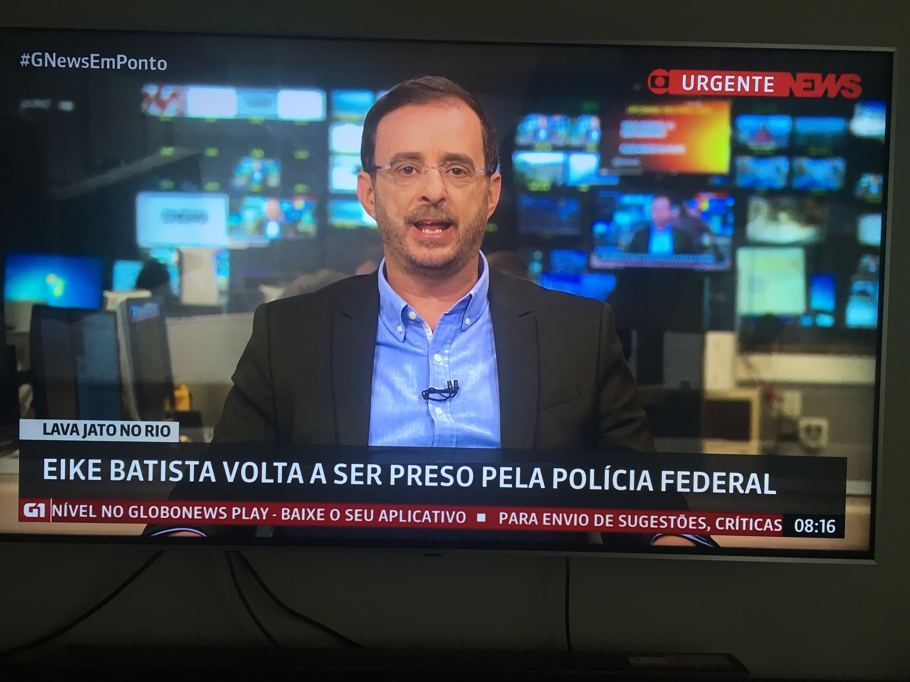
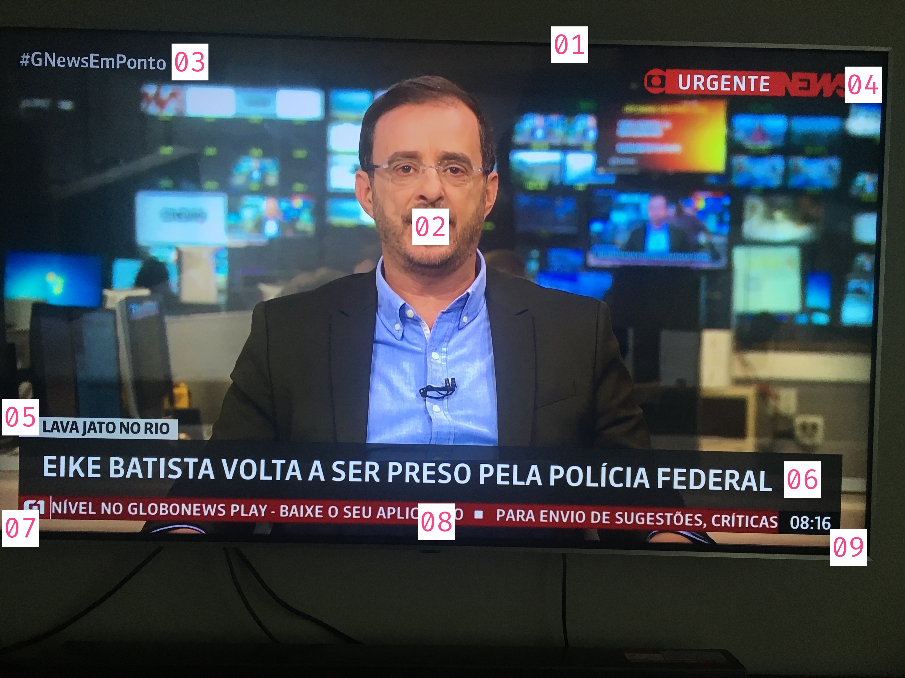

# Desafio333 - Agosto 2019 - [SASS](http://sass-lang.com/)

O desafio do mês de Agosto é um convite para a comunidade conhecer as maravilhas do SASS.
Você criará uma página inspirada em uma tela de transmissão da Globo News.

Este é o mockup que você precisa reproduzir de forma responsiva no navegador usando SASS:

## Detalhes do Mockup

1. Container principal que representará a TV.
2. Imagem principal que representará o que está passando na TV.
3. Hashtag topo esquerda.
4. Logo topo direita.
5. Subtítulo.
6. Título.
7. Mini-logo baixo esquerda.
8. Texto scrollando com últimas notícias.
9. Hora baixo direita.

## Regras

- O texto (8) precisa rolar horizontalmente na tela (efeito "marquee").
- A data limite para o seu Pull Request é **24/08/2019 às 17hs**.
- Você pode usar o Stack que quiser e a forma de desenvolver que achar melhor. A única obrigação é o uso de SASS (SCSS).
- No seu Pull Request, descreva detalhes sobre o que você fez e, se possível, adicione um screenshot e um link para visualizar o seu trabalho no navegador (pode usar Codepen, Github Pages, CodeSandbox ou o que achar melhor). Quanto melhor for sua descrição, maiores as chances de receber votos da comunidade.

## FAQ

### Tenho que fazer uma representação perfeita do que está no Mockup (mesma hashtag, mesmas images, etc) ?

Você precisa ganhar o voto popular e a sua criatividade é o fator mais importante no desafio. Faça como achar melhor, desde que o produto final esteja resolvendo os 9 problemas apresentados nos detalhes do mockup de forma responsiva.

### Já enviei meu Pull Request e gostaria de fazer alterações. Posso ?

Todos os commits que você adicionar no seu Fork vão parar no seu Pull Request. Então você tem até a data limite (24/08/2019) para fazer quantas edições você achar necessário. 

###

Veja o [README](../README.md) principal para mais detalhes.

**Caso tenha dúvidas, edite este arquivo e adiciona sua pergunta no FAQ**
