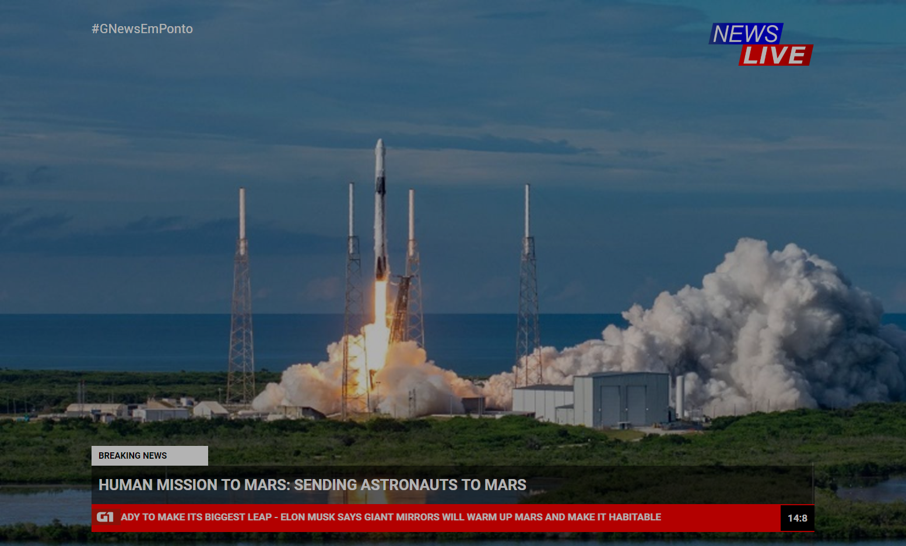

Desafio 333

feito por: Ester Gomes(eessgg)

- Usei sass e flexbox para o layout da tela, cada elemento estilizado separadamente com suas classes
- Js no relógio e marquee com keyframes

link código: https://codepen.io/estergomes/pen/OJLpVOd
