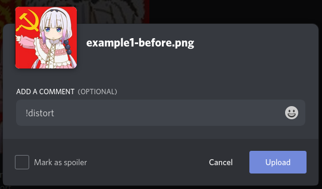

# BOT CONTENT AWARE SCALE FOR DISCORD

I made this project for [desafio333](https://github.com/codigofalado/desafio333/blob/master/2020-Bot-Discord/README.md).


## Commands

`!distort help`: the bot will explain how use `!distort` command

`!distort`: will resize your image using [Seam Carving](https://en.wikipedia.org/w/index.php?title=Seam_carving) algorithm like [this](https://www.youtube.com/watch?v=8rK67BT6Ivw) meme.

Just send a image with `!distort` command in comment:



### Effect

Before | After

 

## Usage

### Add in your server

You can add this bot in your sever using the link below:

https://discord.com/oauth2/authorize?client_id=737393713759649794&scope=bot&permissions=166976

### Requirements for build

If you want download code and work with it, you will need:

- Go
- [Caire](https://github.com/esimov/caire) installed
- Make a .env file only with: 

```
TOKEN=inserthereyourtoken
PORT=5000
```
