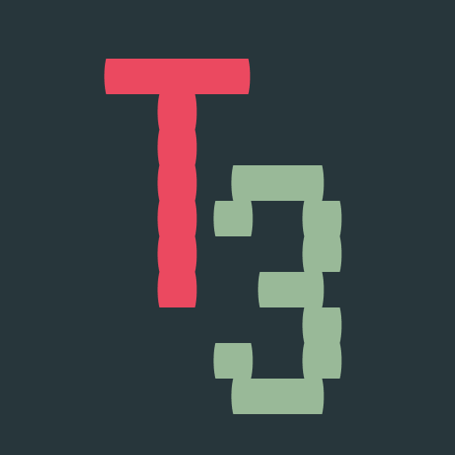

  

<h1 align="center">
  Tetris 333
</h1>

  

  

  <!-- License -->
  

  <!-- codefactor -->
  

   
  <!-- if your app is a website deployed on Netlify -->
  
  <!-- Social -->
  

<!-- summary -->

  <a href="#clipboard-descrição">Descrição</a>&nbsp;&nbsp;&nbsp;|&nbsp;&nbsp;&nbsp;
  <a href="#sparkles-funcionalidades">Funcionalidades</a>&nbsp;&nbsp;&nbsp;|&nbsp;&nbsp;&nbsp;
  <a href="#-o-que-tem-dentro">O que tem dentro</a>&nbsp;&nbsp;&nbsp;|&nbsp;&nbsp;&nbsp;
  <a href="#memo-licença">Licença</a>

---

  <a href="https://tetris333.netlify.app/">Click aqui para testar</a>

---

## :clipboard: Descrição

:tada: Finalmente, após inumeras xicaras de café, terminamos a v1.0 do nosso jogo de Tetris para a #QuarentenaTech.  Optamos por fazer para web pois ficaria mais fácil de testar e compartilhar com qualquer pessoa.

Utilizamos a biblioteca [p5.js](https://p5js.org) pela influência do [Daniel Shiffman](https://github.com/shiffman) e seu canal [Coding Train](https://www.youtube.com/user/shiffman). Por não ser uma lib feita para desenvolver jogos nós tivemo muitos empecilhos em especial para detectar colisões, o que apenas garantiu mais aprendizado para os membros da equipe. Após ler este [artigo](https://dev.to/christiankastner/integrating-p5-js-with-react-i0d) decidimos usar o React para toda a interface off-game.

:bulb: Ainda queremos continuar evoluindo nosso jogo depois do desafio, qualquer sugestão que tiver, só comentar aqui em baixo :arrow_down:, ficaramos muito felizes com qualquer feadback :)

<!-- Nós pretendemos criar um site contendo diversos jogos arcades classicos. -->

## :sparkles: Funcionalidades

- Ao entrar no [site](https://tetris333.netlify.app/) você vai encontrar um menu com três botões:
  - **Jogar**: levará você para a página do jogo do Tetris em si.
  - **Configurações**: onde você poderá configurar a dificuldade, habilitar o grid e a peça fantasma. Toda a configuração é salva no _local storage_ do seu navegador.
  - **Ajuda**: aqui você encontrará informações sobre como jogar o jogo.

### :fire: Requisitos escolhidos

  - [ ] Implementação de Sons e Cores
  - [x] Previsão de próxima peça
  - [x] Escolha entre pelo menos 3 dificuldades
  - [ ] Contabilização de Pontos e Game Over
  - [x] Poder habilitar Peça Fantasma

## 🧐 O que tem dentro?

### :label: Linguagem
- [TypeScript](https://www.typescriptlang.org/)

### :computer: Tecnologias

- [p5.js](https://p5js.org)
- [ReactJS](https://reactjs.org/)

### :art: Ferramentas de Linter
- [Eslint](https://eslint.org/)
- [Prettier](https://prettier.io/)
- [EditorConfig](https://editorconfig.org/)

### :package:  Pacotes

| Função               | Biblioteca                                              |
| -------------------- | ------------------------------------------------------- |
| Fonte                | [V323](https://fonts.google.com/specimen/VT323)         |
| Icones               | [React Icons](https://react-icons.netlify.com/#/)       |
| CSS in JS            | [Styled Compoments](https://www.styled-components.com/) |
| Manipulação de cores | [Polished](https://polished.js.org/)                    |
| Sons                 | [freesound](https://freesound.org/)                     |

:bulb: **Para mais detalhes, veja o `package.json`.**

:bulb: **Segue o [link](https://www.figma.com/file/L3sSkpTpFBcSdmmk7mr7J1/tetris?node-id=0%3A1) para o projeto no `Figma`.**

## 🎓 Mais sobre p5.js

Caso queira conhecer mais sobre a biblioteca grafica que usamos no projeto só dar uma olhada no [site do p5.js](https://p5js.org). Lá tem toda documentação e ajuda sobre como programar usando o p5.js.

Tem também o [Coding Train](https://www.youtube.com/user/shiffman) um canal do youtube que ensina muita coisa de programação e faz uns projetos muito legais usando o p5.js.

## :memo: Licença

Este projeto está sobre a licença MIT. Veja o arquivo [LICENSE] (LICENSE) para mais detalhes.
